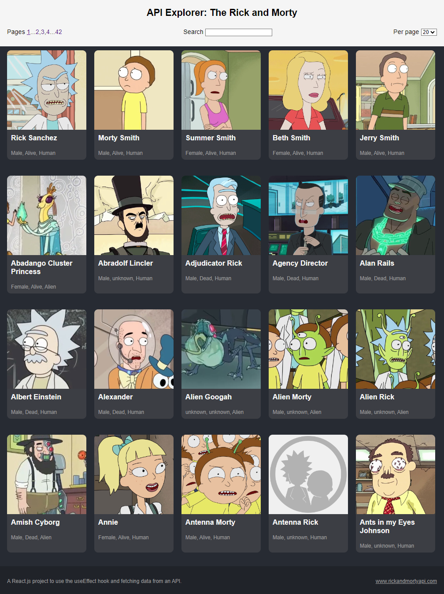

# ReactJS API Explorer App

A dynamic and interactive API explorer built with React.js that allows users to make requests to public APIs and view the responses in real-time. This project is designed to help developers and testers interact with APIs, visualize responses, and test endpoints efficiently.

## Screenshot

  <!-- Replace with the path to your screenshot image -->

## Live Demo

You can try out the live demo of this project [here](https://reactjs-app-api-explorer.vercel.app/).

## Features

- **API Requests**: Send GET type of HTTP request using the `fetch` API.
- **Card Component**: Displays character data in a user-friendly card format.
- **Real-time Response Display**: View the API response in real-time, including status codes and response data.
- **History Tracking**: Keep track of your previous requests and responses.
- **Responsive Design**: Fully responsive and optimized for various screen sizes.

## Installation

### Using Create React App

To get started with the project locally using Create React App, follow these steps:

1. **Clone the repository:**

    ```bash
    git clone https://github.com/EthanEDev/reactjs-app-api-explorer.git
    ```

2. **Navigate to the project directory:**

    ```bash
    cd reactjs-app-api-explorer
    ```

3. **Install dependencies:**

    ```bash
    npm install
    ```

4. **Start the development server:**

    ```bash
    npm start
    ```

### Using Vite

If the project uses Vite instead of Create React App, follow these steps:

1. **Clone the repository:**

    ```bash
    git clone https://github.com/EthanEDev/reactjs-app-api-explorer.git
    ```

2. **Navigate to the project directory:**

    ```bash
    cd reactjs-app-api-explorer
    ```

3. **Install dependencies:**

    ```bash
    npm install
    ```

4. **Start the development server:**

    ```bash
    npm run dev
    ```

## Usage

Once the application is running, you can explore APIs by:

- **Sending the Request**: Click the "Send" button to make the request.
- **Viewing the Response**: The response, including status code and data, will be displayed in real-time.
- **Displaying Characters**: Character data retrieved from APIs can be displayed using the built-in Card component.

## Technologies Used

- React.js
- JavaScript (ES6+)
- CSS
- `fetch` API (for handling HTTP requests)

## Contributing

Contributions are welcome! If you have suggestions for improvements or find bugs, please open an issue or submit a pull request.

1. Fork the repository.
2. Create a new branch (`git checkout -b feature-branch`).
3. Commit your changes (`git commit -am 'Add new feature'`).
4. Push to the branch (`git push origin feature-branch`).
5. Create a new Pull Request.

## License

This project is licensed under the MIT License - see the [LICENSE](LICENSE) file for details.

## Contact

If you have any questions, feel free to reach out to me via GitHub issues or at [ethan.ekhtiyar@gmail.com](mailto:ethan.ekhtiyar@gmail.com).
